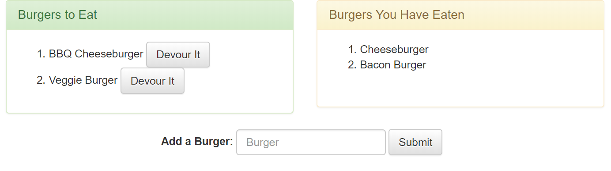

# Eat Da Burger

## About this Project
Just a silly app to eat burgers and add new ones. That's all there is to see here.

Technologies used in this app include Node.js, Express, Body-Parser, MySQL and Handlebars.

## Screenshots
Burgers to Eat and Burgers You Have Eaten

Added a New Burger

## Install and Run
Clone the repository to your local machine. Run `npm install` to install the dependencies. Import `./db/schema.sql` then `./db/seeds.sql` in your favorite MySQL administrator console. Then run `node start` to start the server on `localhost:8080`.

## Deployed Site
[https://young-cove-19477.herokuapp.com/](https://young-cove-19477.herokuapp.com/)

## My Portfolio
[https://joseph526.github.io/](https://joseph526.github.io/)